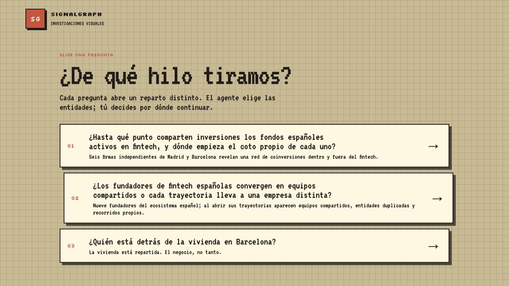
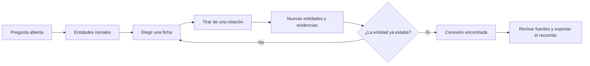
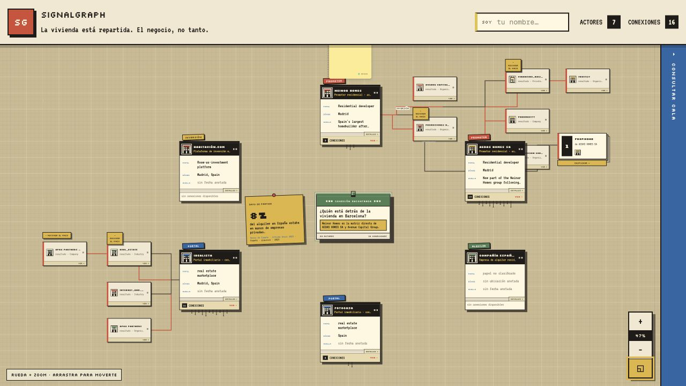
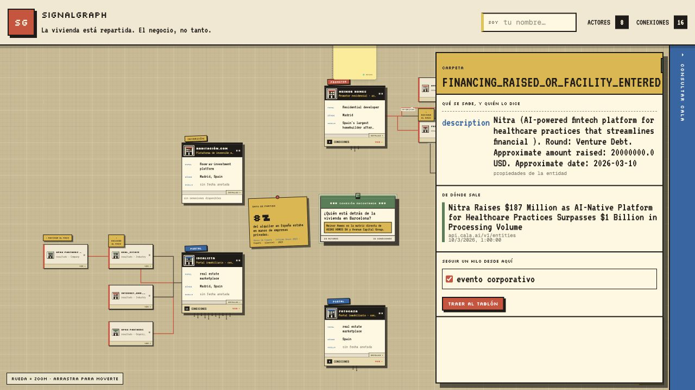

<div align="center">

# SignalGraph

### Investiga tirando del hilo, no saltando directamente a una respuesta.

Un tablón visual para recorrer el grafo de conocimiento de [Cala AI](https://cala.ai/), revelar relaciones una a una y conservar el camino que convierte una pregunta abierta en un hallazgo verificable.

[Ver la demo](https://signal-graph-tau.vercel.app) · [Explorar el código](https://github.com/Gorkah/SignalGraph) · [Leer la publicación del hackathon](https://lnkd.in/p/epzmU-jk)


</div>



## La idea

Los buscadores y los chatbots suelen ocultar el recorrido y entregar una respuesta terminada. SignalGraph propone lo contrario: **hacer visible la investigación**.

Empiezas con una pregunta, no con un dashboard. Un agente propone las entidades iniciales y las coloca alrededor del caso. A partir de ahí tú decides qué relación seguir: una inversión, una fundación, una propiedad, un puesto o cualquier otro vínculo disponible. Cada gesto añade nuevas fichas y nuevos hilos al tablero.

El momento importante ocurre cuando un hilo vuelve a una entidad que ya estaba allí. SignalGraph no reemplaza el recorrido por una conclusión opaca: marca la coincidencia, conecta sus dos orígenes y la convierte en un hallazgo que todavía puedes inspeccionar fuente por fuente.

> El agente decide qué puede ser relevante. La persona decide por dónde continuar. El grafo conserva cómo se llegó al resultado.

## Cómo se investiga



1. **Elige una pregunta.** Cada caso tiene un reparto, vocabulario y criterio de hallazgo propios.
2. **Lee las fichas.** La portada resume el papel de cada entidad; el reverso y la carpeta muestran el detalle.
3. **Tira de un hilo.** Escoge una relación concreta y trae sus vecinos al tablero.
4. **Reconoce un cruce.** Si dos recorridos llegan a la misma entidad, aparece una conexión comprobable.
5. **Audita el resultado.** Cada dato conserva la consulta, el archivo, la fecha y, cuando existe, la URL de origen.
6. **Continúa o comparte.** Abre otra pregunta, deja notas colaborativas o exporta el recorrido hasta una ficha como PNG.

La captura ya no corresponde al estado inicial. Primero se siguió la propiedad de Aedas hasta reencontrar a Neinor Homes; desde Neinor se abrió la rama de inversión hasta Avenue Capital Group y, desde Avenue, se avanzó otra capa por inversiones y eventos corporativos. En paralelo, idealista abre sus propias ramas de inversión y sector. El resultado reúne **16 conexiones** y deja ver tanto la profundidad de un hilo como las bifurcaciones que se descartaron o todavía se pueden explorar.



## Qué hace diferente a SignalGraph

| En una búsqueda convencional | En SignalGraph |
| --- | --- |
| La respuesta aparece al final de una lista | La respuesta emerge de relaciones visibles |
| El proceso queda oculto | Cada paso permanece en el tablero |
| Las fuentes están separadas del razonamiento | Cada claim conserva su procedencia |
| La IA decide el recorrido completo | La IA propone; la persona elige el siguiente hilo |
| Colaborar significa compartir un enlace terminado | Varias personas pueden investigar, señalar y anotar el mismo caso |

## Un hallazgo, con su recorrido a la vista

En el caso de vivienda, el tablero parte de una pregunta amplia y de una referencia de contexto. Al seguir la relación de propiedad de Aedas, el hilo regresa a una ficha que ya estaba clavada: Neinor Homes. La investigación continúa desde ese cruce: sus inversiones llevan hasta Avenue Capital Group y, desde allí, una nueva relación alcanza un evento de financiación. Incluso en esa tercera capa se conserva la descripción, la fecha, la consulta de Cala y el artículo original que sostiene el dato.



## Funcionalidades

- Tres investigaciones preparadas: coinversiones fintech, trayectorias de fundadores y vivienda en Barcelona.
- Tablón infinito con zoom, paneo, encaje automático y fichas arrastrables sobre rejilla.
- Relaciones semánticas con detección de reencuentros por identidad normalizada.
- Portada, reverso y carpeta de fuentes para cada entidad.
- Consultas nuevas a Cala desde la bandeja, con evidencia local para que la demo ensayada sea inmediata.
- Preguntas de seguimiento y respuestas narrativas generadas con OpenAI o Pioneer a partir de la evidencia disponible.
- Cursores y notas compartidas en tiempo real mediante Liveblocks.
- Persistencia local del caso y exportación del recorrido seleccionado a PNG.
- Validación de APIs con Zod y caché compatible con entornos locales y despliegues serverless en Vercel.

## Arquitectura

SignalGraph separa las decisiones editoriales de la mecánica del tablero:

- `data/cases/*.json` define la pregunta, el reparto, el lenguaje, la acción sugerida y cómo se redacta un hallazgo.
- `data/cala/` y `data/relations/` guardan la evidencia y las proyecciones preparadas para la demo.
- `lib/seed.ts` convierte manifiestos y evidencia en el grafo inicial.
- `lib/store.ts` coordina el recorrido: abrir fichas, tirar relaciones, detectar cruces y construir nuevas ramas.
- `components/` dibuja el tablón, las fichas, los hilos, la bandeja, las fuentes y la colaboración.
- `app/api/` conecta las consultas vivas con Cala, la generación narrativa y la autenticación de Liveblocks.

```text
Cala AI / evidencia local
          │
          ▼
  manifiesto del caso ──► grafo inicial
                              │
                    interacción humana
                              │
                              ▼
              proyección de una relación
                              │
                 ┌────────────┴────────────┐
                 ▼                         ▼
           nueva entidad          entidad reencontrada
                 │                         │
                 └────────────┬────────────┘
                              ▼
                    tablero trazable
```

## Puesta en marcha

### Requisitos

- Node.js 22 o superior.
- Una clave de Cala AI.
- Un proyecto de Liveblocks para la presencia y las notas compartidas.
- Opcionalmente, una clave de OpenAI o Pioneer para las ramas narrativas generadas.

### Instalación

```bash
git clone https://github.com/Gorkah/SignalGraph.git
cd SignalGraph
npm install
```

Crea `.env.local`:

```dotenv
# Requeridas
CALA_API_KEY=...
LIVEBLOCKS_SECRET_KEY=...

# Cala
CALA_BASE_URL=https://api.cala.ai
CALA_LIVE=1
CALA_TIMEOUT_MS=65000

# Narrativa generada: configura OpenAI o Pioneer
OPENAI_API_KEY=
OPENAI_MODEL=gpt-5.4-mini

PIONEER_API_KEY=
PIONEER_BASE_URL=https://api.pioneer.ai
PIONEER_MODEL=Qwen/Qwen3-8B

# Opcional: caso recomendado en la portada
CASE_SLUG=vivienda-negocio-espana
```

Después:

```bash
npm run dev
```

Abre [http://localhost:3000](http://localhost:3000). Para trabajar solo con los volcados de relaciones incluidos, usa `CALA_LIVE=0`; el esquema sigue requiriendo que `CALA_API_KEY` tenga algún valor.

### Comprobaciones

```bash
npm run lint
npm run build
npm run type-check
```

El primer `npm run build` genera los tipos globales de rutas de Next.js que utiliza `npm run type-check`.

## Despliegue

La aplicación está desplegada en [signal-graph-tau.vercel.app](https://signal-graph-tau.vercel.app). En Vercel la caché evita escribir en el filesystem de solo lectura y usa memoria durante la vida de cada instancia; en local también puede persistir respuestas bajo `data/cache/`.

Configura en el proyecto de Vercel las mismas variables de entorno de `.env.local`. `CALA_API_KEY` y `LIVEBLOCKS_SECRET_KEY` son necesarias para la experiencia completa; añade OpenAI o Pioneer si quieres habilitar preguntas y respuestas narrativas nuevas.

## El equipo

Construido en unas diez horas por **Gorka Hernandez**, **Arnau Ropero Garcia** y **Santiago García Monsalve** durante el hackathon de **{Tech: Europe} × Cala**, donde el proyecto obtuvo el **tercer puesto**.

La publicación de LinkedIn preparada para presentar el proyecto está en [`docs/linkedin-post.md`](docs/linkedin-post.md).

## Licencia

Este repositorio no incluye por ahora un archivo de licencia. El código no debe considerarse de uso abierto hasta que se añada una licencia explícita.
